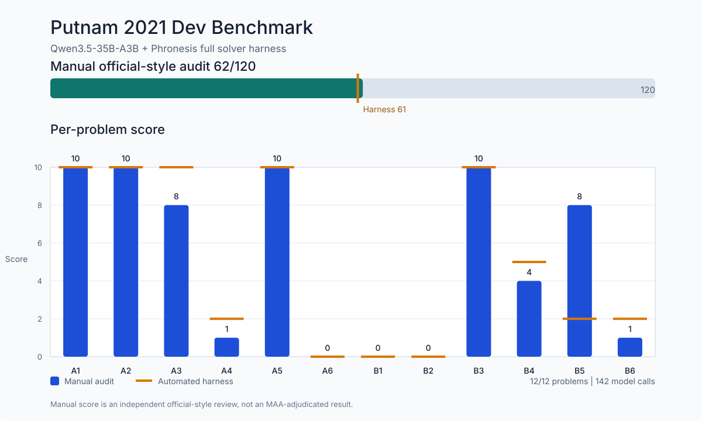

# Phronesis Harness

Verifier-guided proof-solving harness for Putnam-style math problems.

This repository contains the harness-only code used in the Phronesis project. It is not a trained model and it does not include training data. The harness runs an OpenAI-compatible model endpoint and adds proof-specific inference steps around it:

- solver prompt orchestration
- final-answer and conclusion extraction
- targeted retry by failure type
- repair and consolidation passes
- adversarial proof breaking
- arithmetic sanity checks
- capped-output rejection
- JSONL artifact logging and schema validation

## Architecture

```text
problem
  -> solver attempt
  -> proof audit + conclusion extraction + arithmetic checks
  -> adversarial proof breaker
  -> targeted retry based on first failure
  -> optional repair
  -> optional consolidation
  -> pairwise/tournament selection
  -> optional polish only if the proof passes validity gates
  -> selected proof + score + JSONL artifacts
```

The harness is role-based. The same model can be used for every role, or separate OpenAI-compatible endpoints can be assigned for solver, judge, breaker, repair, and consolidation.

## Benchmark Snapshot

The included example config/result summary comes from a Putnam 2021 dev run with:

- Model: `Qwen/Qwen3.5-35B-A3B`
- Serving: `vLLM`
- Hardware: `1x NVIDIA H200`
- Weights: `FP8`
- KV cache: `BF16`
- Hints/solutions in prompt: none

**Manual official-style score: 62/120**



Result details:

- Harness-selected score: `61/120`
- Manual-audited score: **`62/120`**
- Reasonable manual uncertainty band: `60-64/120`
- Problems completed: `12/12`
- Total model calls: `142`

Every selected proof was compared with the published Putnam 2021 answers and solutions. The score is not an official MAA adjudication; it is a research benchmark result from an independent official-style manual audit. See the [proof-by-proof audit](examples/qwen35_2021_dev_harness_balanced/MANUAL_AUDIT.md) and [machine-readable manual scores](examples/qwen35_2021_dev_harness_balanced/manual_scores.json).

## Files

- `scripts/run_solver_harness.py`: main verifier-guided solver harness
- `scripts/run_eval_harness.py`: shared eval utilities
- `scripts/strict_proof_auditor.py`: proof-audit normalization and caps
- `scripts/validate_artifact_schema.py`: artifact validation
- `prompts/`: prompt and strategy files used by the run
- `examples/qwen35_2021_dev_harness_balanced/`: run config and summarized artifacts for the reported benchmark
- `scripts/render_benchmark_chart.py`: deterministic SVG benchmark-chart generator

## License

Code is licensed under Apache-2.0. Putnam problem statements and official solutions are not owned by this repository and are not covered by this license.

## Citation

```bibtex
@misc{phronesisHarness2026,
  title        = {Phronesis Harness},
  author       = {Flownium},
  year         = {2026},
  howpublished = {\url{https://github.com/itsflownium/phronesis-harness}},
  note         = {GitHub repository. Published under the pseudonym Flownium},
}
```
